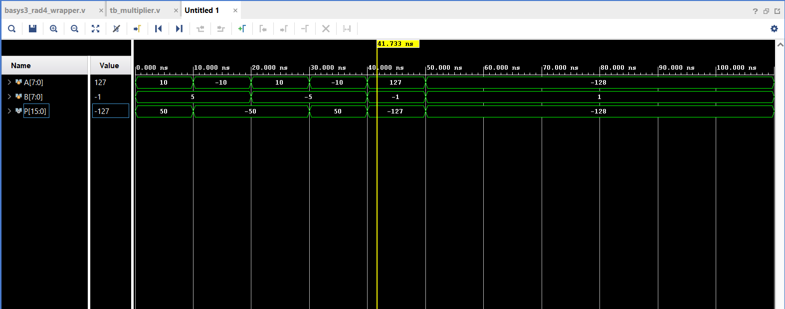
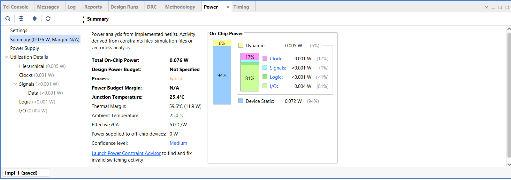
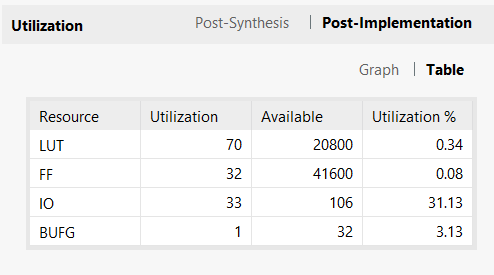

# Radix-4 Modified Booth Multiplication Algorithm

This project implements an **8-bit signed multiplier** using the **Modified Booth Radix-4 algorithm** in Verilog HDL. The design is synthesized and implemented on the **Artix-7 FPGA Basys 3 board** using **Xilinx Vivado**.

Modified Booth multiplication is specially used for **signed multiplication** because it reduces the number of partial products and improves speed compared to conventional multiplication methods.

## Features

- 8-bit signed multiplication
- Modified Booth Radix-4 algorithm
- Structural Verilog design
- FPGA implementation on Basys 3
- Simulation, power, and area analysis included

## Files

- `booth_rad4_multiplier.v` – Top multiplier module
- `booth_encoder_rad4.v` – Radix-4 Booth encoder
- `csa.v` – Carry Save Adder
- `final_adder.v` – Final adder stage
- `basys3_rad4_wrapper.v` – Wrapper for Basys 3 board
- `tb_multiplier.v` – Testbench
- `basys3_multiplier.xdc` – Constraints file

## Simulation Result

## Power Analysis

## Area Utilisation

## Tool Used

- Xilinx Vivado
- HDL : Verilog

## FPGA Board

- Artix-7 FPGA Basys 3
